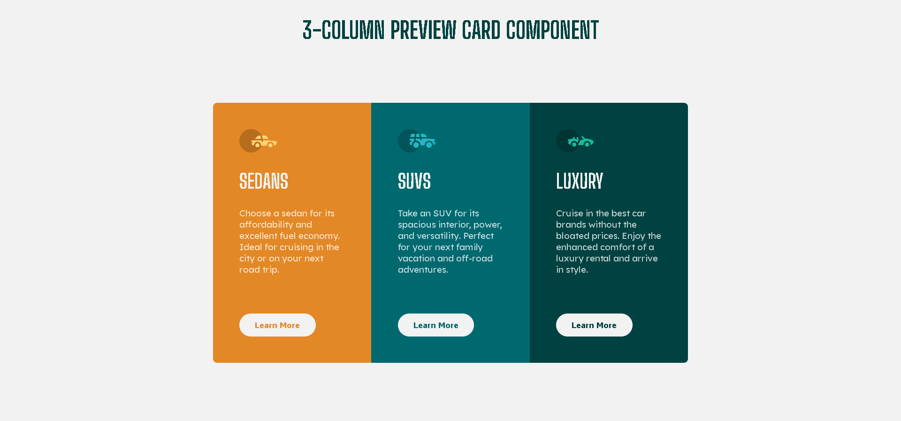

# Frontend Mentor - 3-column preview card component solution

This is a solution to the [3-column preview card component challenge on Frontend Mentor](https://www.frontendmentor.io/challenges/3column-preview-card-component-pH92eAR2-). Frontend Mentor challenges help you improve your coding skills by building realistic projects.

## Table of contents

- [Overview](#overview)
  - [The challenge](#the-challenge)
  - [Screenshot](#screenshot)
  - [Links](#links)
- [My process](#my-process)
  - [Built with](#built-with)
  - [What I learned](#what-i-learned)
  - [Useful resources](#useful-resources)
- [Author](#author)

## Overview

### The challenge

Users should be able to:

- View the optimal layout depending on their device's screen size
- See hover states for interactive elements

### Screenshot



### Links

- Live Site URL: [https://joeljairo.github.io/3-column-preview-card-component/](https://joeljairo.github.io/3-column-preview-card-component/)

## My process

### Built with

- Semantic HTML5 markup
- CSS custom properties
- Flexbox
- Mobile-first workflow
- Responsive design

### What I learned

```css
/* -- Custom properties (variables) -- */
:root {
  --bright-orange: hsl(31, 77%, 52%);
  --dark-cyan: hsl(184, 100%, 22%);
  --very-dark-cyan: hsl(179, 100%, 13%);
  --very-light-gray: hsl(0, 0%, 95%);
  --border-radious: 7px;
} ...
.sedans {
  background-color: var(--bright-orange);
  border-radius: var(--border-radious) var(--border-radious) 0 0;
}

/* -- Media queries, and flexbox -- */
@media screen and (min-width: 800px) {
  .container {
    margin: 100px auto;
    max-width: 810px;
    display: flex;
  }

  section {
    flex: 1 1 270px;
  }...
```

### Useful resources

- [https://developer.mozilla.org/en-US/docs/Web/CSS/Using_CSS_custom_properties](https://developer.mozilla.org/en-US/docs/Web/CSS/Using_CSS_custom_properties) - Here I've learned how to use CSS variables. I really liked this, and I will use it going forward.
- [https://www.linkedin.com/learning/css-essential-training](https://www.linkedin.com/learning/css-essential-training-3?contextUrn=urn%3Ali%3AlyndaLearningPath%3A5ebaefdc498e440b07b53ea1) - This is an amazing course which helped me in the core concepts of CSS, also understand flexbox, and responsive layouts using media queries. I'd recommend it to anyone who likes CSS.

## Author

- Frontend Mentor - [@JoelJairo](https://www.frontendmentor.io/profile/JoelJairo)
